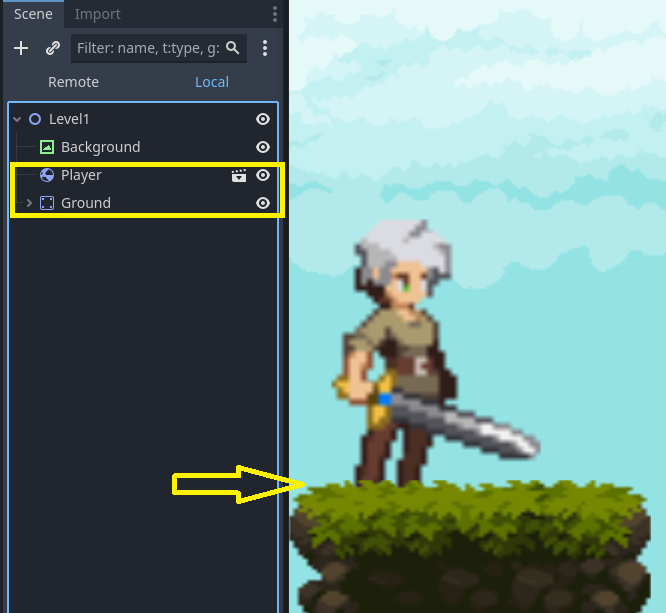
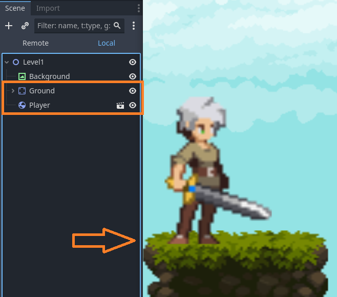

## Notes

* Sprites are drawn in the top-down order that they appear in in the **Scene** tree. This means you can make a sprite (character) appear to be in front of another sprite (floor) by placing the "floor" Node above the "character" sprite in the **Scene** tree. This causes the floor sprite to be drawn before the character sprite, so the character appears to be closer to the screen than the floor sprite.
  * In this example the **Player** scene is drawn before the **Ground** scene, causing the player to be behind the Ground texture.

    

  * In this example the **Ground** scene is drawn before the **Player** scene, causing the player to be (correctly) on top of the Ground texture.

    

* If you want to scale a RigidBody2D Node, then you need to scale the child `Sprite2D` and `CollisionShape2D` Nodes and **not** the `RigidBody2D` Node itself.